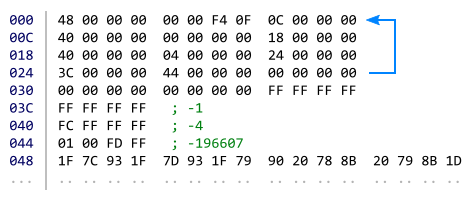
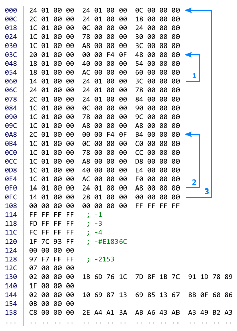

This repository contains rules for image compression challenge, which can help to learn high level and low level program optimization techniques.

In this challenge you need to create `image.slif` file, which contains compressed image. The smaller this file is, the better the solution (score is defined as file size in bytes). For solution to be valid, two of its properties must lie within certain limits: image quality (`PSNR`) and amount of steps for decompression algorithm (`Operation count`). To understand how to make such file, you need to either analyze test program and example solutions or read description in hidden section below.

To check if solution is valid or not, test program should be executed. It compares compressed image with reference image (786432 bytes) and shows "Success" message if solution is valid. Test program is available in two versions: made with C# and made with JavaScript. C# version (both source and binary) can be downloaded [here](https://github.com/Vort/SLIF/blob/master/slif.zip?raw=true), JavaScript version is available online and can be accessed with [this](https://vort.github.io/SLIF/) link. These versions should behave the same, but in case of differences, results from C# version are preferred.

To better understand how test program works, two example solutions can be used. [Example #1](https://github.com/Vort/SLIF/blob/solutions/image_786516.slif?raw=true) is simple, but it uses no compression (it have size of 786516 bytes, which is larger than reference image). [Example #2](https://github.com/Vort/SLIF/blob/solutions/image_667176.slif?raw=true) is more advanced and saves 15% of space (it have size of 667176 bytes). When example #2 is loaded into test program (for C# version, example is already located inside of `.zip` archive), it should produce following output:
```
Success
File size: 667176
PSNR: 34.0640466
Operation count: 1342951
```

<details>
  <summary>Description of how test program and example solutions behave</summary>
  
  Operation of test program consists of several steps:
  1. `.slif` file is loaded and its first part (header) is checked for correctness;
  2. Large memory block is allocated and filled with zeros;
  3. Second part of the file (subleq code and data) is copied to the start of memory block;
  4. Execution of subleq machine code is started;
  5. Once execution is finished, image data is extracted from the end of memory block;
  6. Error value is calculated by comparing reference image data with image data generated by subleq code;
  7. If error value is less than `20358302` and operation count is less than `100000000000`, "Success" message is displayed.
  
  Header of `.slif` file is 12 bytes in size and consists of 4 parts: signature (4 bytes), image width (2 bytes), image height (2 bytes) and available memory size (4 bytes). However, for this challenge, all these values are constant, which means that `.slif` file must always start with these bytes: `53 4C 49 46 00 02 00 02 00 00 00 10`. Byte order used in this challenge is little-endian, that's why value of `0x0200` is encoded as `00 02` and `0x10000000` is encoded as `00 00 00 10`.
  
  Size of memory block determines how many bytes are available for use by subleq program. For this challenge, this value is set to 256 MiB. It means that subleq program can read and write bytes in `0x00000000` .. `0x0FFFFFFF` address range.
  
  Contents of memory block are just bytes. But during program execution, some of these bytes can be interpreted as subleq instructions. Each subleq instruction occupies 12 bytes and consists of 3 parts: addresses `pa`, `pb` and `pc`. When instruction is executed, value `a` (at address `pa`) is **sub**tracted from value `b` (at address `pb`) and result (`b = b - a`) is stored at address `pb`. If result (`b`) is **l**ess or **eq**ual to `0`, then execution is transferred to address `pc` (instruction pointer `ip = pc`), otherwise next instruction is executed (`ip = ip + 12`).
  
  Image data is yet another interpretation for bytes. When subleq program is terminated, contents from `0x0FF40000` .. `0x0FFFFFFF` range becomes processed by test program as image pixels. Each byte in this range represents intensity of red, green or blue component of pixel color. By multiplying size of the pixel (3 bytes, 24 bits) by image width (512 pixels) and height (512 pixels), size of reference image data (786432 bytes) can be obtained.
  
  To check if image quality is within acceptable limits, sum of squared differences between byte values of reference image data and image data, produced by subleq code, is calculated. To make this number more readable, it is converted into `PSNR` format. Error smaller than `20358302` corresponds to PSNR larger than `34`.
  
  To better understand how subleq code can be used to decompress image data, example solutions can be examined.
  
  Example #1 consists of 5 instructions, 3 constants and 1 variable. Instructions are located at addresses `000`, `00C`, `018`, `024` and `030`, 2 constants (4 bytes each) are located at `03C` (-1) and `040` (-4), 1 variable 4 bytes in size is located at `044` (-196607) and 1 constant 786432 bytes in size starts at `048`.
  
  
  
  Example #1 simply transfers image data from one memory location to another. Instruction `000` takes 4 bytes from location `0x00000048` and moves them (with negation) to location `0x0FF40000`. Instructions `00C` and `018` adjusts pointers `pa` (`000`) and `pb` (`004`) inside instruction `000` by adding `4` to them. Instruction `024` loops to instruction `000` until counter at `044` becomes greater than zero (jump is executed 196607 times, resulting in 196608 iterations in total). Instruction `030` terminates execution by jumping to address, located out of memory bounds (`0xFFFFFFFF`).
  
  Example #2 extends idea of example #1 by splitting image into pairs of spans: first span in each pair is filled with fixed color (#E1836C), second span contains raw image data, like in example #1.
  
  
  
  Code of example #2 contains 3 loops. First loop (`03C` to `060`) decodes fixed color span, second loop (`0A8` to `0F0`) decodes raw span and third loop (`000` to `0FC`) iterates over all pairs.
  
  Constant data at `12C` starts with value `07 00 00 00`, which means 8 pixels of constant color should be written. Value `02 00 00 00` at address `130` means that 3 blocks 4 bytes each (4 pixels) should be copied as is (with negation). Value `1F 00 00 00` at `140` means that 32 pixels of fixed color should be written and so on.
  
</details>

To submit your solution, you need to create issue in this repository with title in "Solution by Nickname [score]" format, put there your `.slif` file, `Operation count` value from test program and, optionally, any additional information you want to share. Providing description of how file was created is not required.